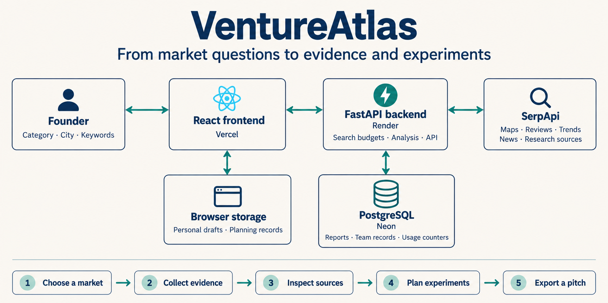

<div align="center">

# VentureAtlas

### Know your market. Make your move.

Market research for founders deciding what to build, where to launch, and what to test next.

[](https://serpapi.com/)


[](LICENSE)

**[Open VentureAtlas](https://ventureatlas-rho.vercel.app)** · **[Browse reports](https://ventureatlas-rho.vercel.app/reports)** · **[Run locally](#run-it-locally)**

Built for the **SerpApi India Hackathon 2026** · **Commerce & Market Intelligence**

<!-- DEMO VIDEO: Add your public or unlisted video URL after recording.
Move this link outside the comment and replace the placeholder:
[Watch the demo — under 3 minutes](PASTE_VIDEO_URL_HERE)
-->

</div>

---

## Before the lease, the launch, or the first investment

Imagine opening a coworking space in Pune. You can find nearby competitors, read reviews and look at search trends, but those pieces still leave questions: Who is already serving this market? What do customers find frustrating? Which assumptions need testing before you spend money?

VentureAtlas brings the investigation into one report. Enter a business category, location and demand keywords, inspect the returned evidence, and turn what you learn into experiments and a working venture pitch.

The goal is a better next decision, with the reasoning and sources close at hand.

## A look inside

<!-- SCREENSHOT 1 — MAIN PRODUCT IMAGE
Save your screenshot as assets/readme/ventureatlas-overview.png.
Show a completed market report with its title, summary and report navigation visible.
Use a real report if available; keep the Sample report label visible if showing synthetic data.
Move the image line below outside this comment when the file exists:

-->

**Try this route:** choose a market → inspect competitors → read customer needs → check the evidence → plan an experiment.

1. Open **Research a market** and enter `Coworking space`, `Pune`, `India`, and `coworking Pune`.
2. Use the **Search-credit planner** to choose the sources you need, then click **Analyze this market**.
3. Open **Market → Competitors** to explore the map, ratings and review counts.
4. Check **Customer needs**, then **Research → Evidence register** to inspect the supporting sources.
5. Use **Strategy → Experiment priorities** to record a hypothesis, a budget and a success measure. Export a working pitch from **Team & exports**.

Live collection requires configured provider access and available credits. Local sample mode uses explicitly labelled synthetic Pune coworking data. Opening a saved report does not run the searches again.

<!-- SCREENSHOT 2 — COMPETITOR EXPLORER
Save as assets/readme/ventureatlas-competitors.png.
Show the map, a useful filter and a few returned competitor rows.
Move the following image line outside this comment:

-->

## From evidence to action

| Workspace | What it helps you do |
| --- | --- |
| **Overview** | Read the opportunity summary, component scores, evidence completeness and next checks. |
| **Market** | Explore competitors, demand over time, customer review topics, news and optional market details. |
| **Research** | Inspect sources, review relevance, check request usage and collect additional evidence. |
| **Strategy** | Connect evidence to assumptions, explore scenarios, estimate break-even and prioritize experiments. |
| **Team & exports** | Work on private team records and turn the investigation into an editable pitch or export. |

Reports open one section at a time. The sidebar keeps the investigation navigable as it grows, while previously visited panels retain their drafts during navigation.

A few details make the workflow useful:

- **Traceable reasoning.** Connect findings, assumptions and decisions to evidence; record contradictory signals and unanswered questions.
- **Experiments with a purpose.** Set impact, uncertainty, cost, time and a success measure before recording an observed result.
- **Comparisons with context.** Compare compatible saved reports and inspect changes in returned competitors, ratings and other tracked signals.
- **Clear separation of data and judgment.** Evidence completeness is shown separately from the opportunity score. User-entered hypotheses and planning records remain identifiable.
- **Private collaboration.** Team workspaces support owner, editor and viewer permissions, shared tasks, comments and owner-approved decisions.

<!-- SCREENSHOT 3 — RESEARCH INTO AN EXPERIMENT
Save as assets/readme/ventureatlas-experiments.png.
Show Experiment priorities with a saved proposed experiment, cost, time and success measure.
Leave results blank if the experiment has not been carried out.
Move the following image line outside this comment:

-->

## Where SerpApi fits

SerpApi provides the live search results behind the market investigation. The backend builds requests, normalizes returned records and stores the report with source references and usage information.

| Source | Use in VentureAtlas |
| --- | --- |
| Google Maps | Discover returned competitors and their available business details. |
| Google Maps Reviews | Collect sampled review excerpts and group recurring customer topics. |
| Google Trends | Examine keyword interest over time, related queries and optional five-year seasonality. |
| Google News | Collect recent market context with links back to the articles. |
| Google Ads Transparency Center | Inspect optional advertising activity for known competitors. |
| Additional research sources | Investigate forums, autocomplete, events, jobs, shopping, directions, hotels, flights, images and Google Scholar. |

With optional sources switched off, core research is estimated at **3–6 searches**. Retries can increase this to **18 provider attempts**. The planner shows estimates before a run, and the finished report records actual attempts by engine. Request counts are not confirmed billable credits.

### Working within a small search budget

Each signed-in account has **20 hosted SerpApi attempts per day**, resetting at midnight IST. Guests on the same client IP share one allowance. Counters persist in the database across restarts.

A separate shared safety cap defaults to **20 attempts per UTC day**, so the project's credit pool can run out before an individual allowance does. When an allowance is exhausted, the interface offers a personal SerpApi key. Personal keys stay in page memory, pass through the backend to the provider, and are excluded from saved reports. Reloading clears them; the key owner's provider charges apply.

## How it works



The diagram shows the core market workflow. The backend manages provider calls, persistent budgets, analysis and report storage. The frontend displays the evidence and supports personal planning records in browser storage. Authenticated team records are stored on the backend.

| Layer | Technology |
| --- | --- |
| Interface | React 19, TypeScript, Vite, TanStack Query |
| Maps and charts | Leaflet, React Leaflet, Recharts |
| API and analysis | Python, FastAPI, Pydantic |
| Data | SQLAlchemy, Alembic, PostgreSQL; SQLite for local development |
| Hosting | Vercel frontend, Render backend, Neon database |
| Tests | pytest, Vitest, Testing Library, GitHub Actions |

## Run it locally

Use **Python 3.12** and **Node.js 22**. These commands use PowerShell.

```powershell
git clone https://github.com/BasilZafar11/VentureAtlas.git
cd VentureAtlas
python -m venv .venv
.\.venv\Scripts\python.exe -m pip install -r backend/requirements-lock.txt
Copy-Item backend/.env.example backend/.env
cd backend
..\.venv\Scripts\python.exe -m alembic upgrade head
..\.venv\Scripts\python.exe -m uvicorn app.main:app --host 127.0.0.1 --port 8000 --no-access-log
```

In a second terminal, from the repository root:

```powershell
cd frontend
npm ci
npm run dev
```

Open **http://127.0.0.1:5173**. The default local configuration uses synthetic sample data and requires no SerpApi key. Keep the supplied Pune example inputs for sample mode.

On macOS or Linux, use `python3 -m venv .venv`, `cp` instead of `Copy-Item`, and `.venv/bin/python` instead of `.venv\Scripts\python.exe` (`../.venv/bin/python` from `backend`).

### Enable live collection

Set these values in `backend/.env`, then restart the backend:

```dotenv
LIVE_SERPAPI_ENABLED=true
SERPAPI_KEY=your_serpapi_key
IP_HASH_SECRET=replace_with_a_random_secret_at_least_32_characters_long
HOSTED_SERPAPI_DAILY_BUDGET=20
HOSTED_SERPAPI_RESERVE=0
```

Generate a random secret locally with `python -c "import secrets; print(secrets.token_urlsafe(32))"` and keep it stable across deployments. SQLite is sufficient for local development. For Neon, set `DATABASE_URL` to your PostgreSQL connection string, retaining its SSL parameters.

Provider secrets belong in the backend environment or the personal-key dialog. Do not put them in `VITE_*` variables, which are included in the browser build.

<details>
<summary><strong>Deploy on Vercel, Render and Neon</strong></summary>

**Vercel:** choose root directory `frontend`, the Vite preset, build command `npm run build`, and output directory `dist`.

```dotenv
VITE_API_URL=https://ventureatlas-api.onrender.com
```

**Render:** deploy the Docker service using `backend/Dockerfile` with `backend` as its build context. Set the live-search environment values above, your Neon `DATABASE_URL`, and:

```dotenv
CORS_ORIGINS=["https://ventureatlas-rho.vercel.app"]
```

Use `/health` as the health-check path. Docker startup runs Alembic migrations before starting the API as a non-root user. Deploy the same Git revision to the frontend and backend. Update the URLs when using your own hosting accounts.

Dashboard environment settings on a manually configured service must be updated in that dashboard; changing `render.yaml` alone does not update them.

</details>

## Verify the project

From the repository root:

```powershell
.\.venv\Scripts\python.exe scripts/check_secrets.py
cd backend
..\.venv\Scripts\python.exe -m pytest -q -p no:cacheprovider
cd ../frontend
npm test -- --run
npm run build
```

The suite covers report behavior, validation, migration round trips, team permissions, session revocation, provider-key handling, concurrent budget claims and daily resets. Provider interactions in these tests are mocked. GitHub Actions runs the backend checks, migration upgrade, frontend tests and production build.

## What to keep in mind

Search results are a sample of what the sources return. They are not a complete census of a market, and the opportunity score does not predict commercial success. Missing or failed sources remain visible in the report.

Market inputs and reports are public; private team records have separate access controls. Personal planning drafts live in the browser, so export anything you need before clearing browser storage. Team accounts currently have no password-recovery flow.

The repository also includes the companion **ResearchScope** workspace at `/research-scope` for paper and patent research. The main hackathon demo described here is VentureAtlas's market-research workflow.

## License

Released under the [MIT License](LICENSE).
